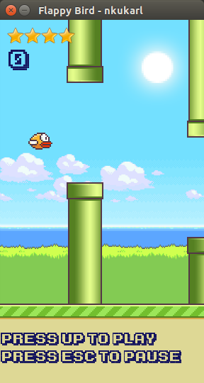
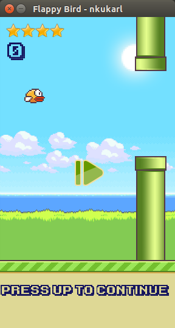
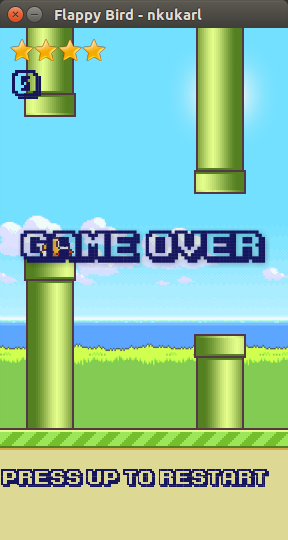

#Flappy Bird
- Python version of the famous Flappy Bird game
- GUI built using Pygame library
- On-screen game instruction
- Random difficulty

##How to play
- Download and install python 2.7 from [here](https://www.python.org/download/releases/2.7/)
- Download and install pygame 1.9 from [here](http://www.pygame.org/download.shtml)
- Click Download ZIP and extract it
- Run `python flappyBird.py` to start game
- Press <kbd>&uarr;</kbd> to play, <kbd>Esc</kbd> to pause, <kbd>&uarr;</kbd> to continue, and <kbd>&uarr;</kbd> to restart when game is over

##Screenshots
play

pause

game over

